# SKAI 화면 캡처 — 기능별 시각 문서

> **한 줄**: SKAI 화면을 기능별로 캡처해 각 스크린샷이 어떤 온톨로지 요소의 렌더인지 짚어둔 문서.
> 사용법 전반은 [USER-GUIDE.md](USER-GUIDE.md), 프로젝트 개요는 [README.md](../README.md) 참조.

## 기준 모드

**기본은 실데이터 라이브 캡처**(`scripts/demo.sh live`, 소스 opensky·adsb.fi·GDELT·METAR·Celestrak)
입니다. 캡처 시각은 **2026-07-08 05:32~05:37 UTC**(KST 14:32~14:37) — 이 시각의 실제 KADIZ
공역 상황을 찍은 스냅샷이라 **재현 불가능**합니다(같은 명령을 다시 돌려도 그 순간의 실항적·실
이상징후는 다시 나오지 않음). 서버는 5분간(3~5 폴링 사이클, 60초 간격) 실데이터를 누적한 뒤
캡처했고, 이 창에서 실측된 것은 항공기 258대·이상징후 26건(전부 실 ADS-B dropout)·기상 5개
공항·위성 통과 77건·뉴스 1건이었습니다. 헤더의 초록 **"LIVE · N초 전 갱신"** 배지가 그 표식입니다.

다만 **비상 스쿽·군용기 접근**처럼 공개 ADS-B로 실측이 사실상 불가능한 유형은 이 라이브 창에 실재하지
않았습니다 — 이런 장면은 `scripts/demo.sh replay`(네트워크 0·결정적 합성 데이터 13건)로 찍은 기존
캡처를 그대로 유지했고, 캡션에 **"(replay 합성 재현 — 라이브에 해당 정황이 없을 때의 결정적 재현)"**
라고 명시해 실측과 재현을 구분했습니다. **재생(replay) 모드**는 헤더의 노란 **"재생 모드 · 고정
스냅샷"** 배지와 각 항목의 **[합성]** 배지로 구분됩니다. 두 모드는 화면 구조·패널 배치가 동일하며
차이는 데이터 출처와 상단 LIVE/재생 배지뿐입니다.

---

## 00. 온보딩 오버레이

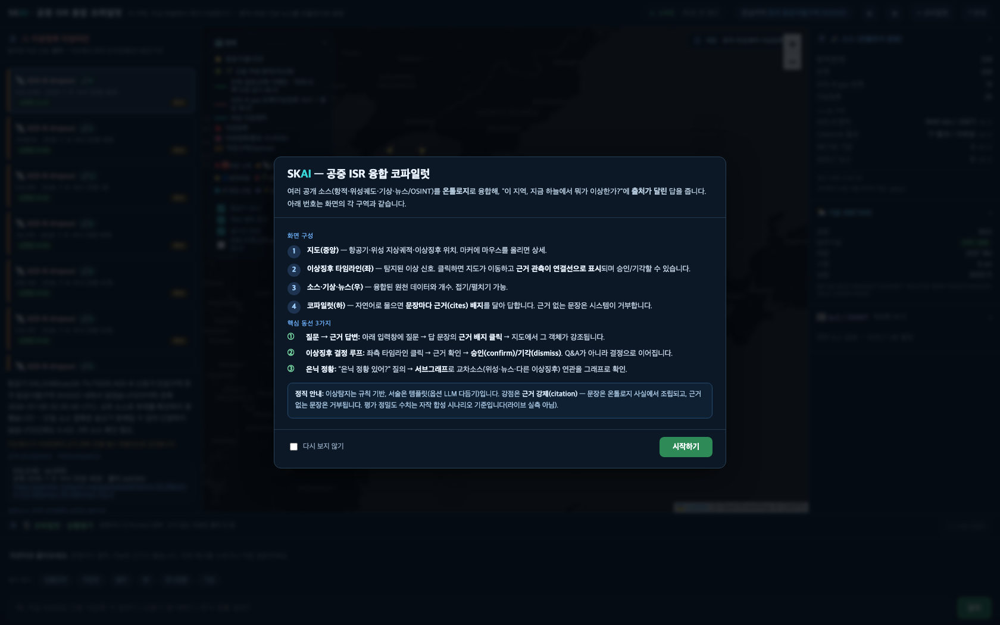

첫 방문(또는 "다시 보지 않기" 미체크) 시 뜨는 안내 오버레이. 화면의 4개 구역(①지도 ②이상징후
타임라인 ③소스·기상·뉴스 ④코파일럿)과 핵심 동선 3가지(질문→근거 답변, 이상징후 결정 루프,
은닉 정황→서브그래프)를 번호로 매핑해 설명합니다. 하단 **정직 안내** 박스가 "이상탐지는 규칙 기반,
서술은 템플릿(옵션 LLM 다듬기)"·"평가 정밀도는 자작 합성 시나리오 기준(라이브 실측 아님)"을 명시 —
과장 없는 정직 표기입니다. 딥링크(`?q=` 또는 `?anom=`)로 진입하면 이 오버레이는 자동 스킵됩니다.
(온보딩 문구 자체는 모드 무관 — 라이브 캡처에서도 동일 오버레이입니다.)

## 01. 전체 개요 (3열 레이아웃)

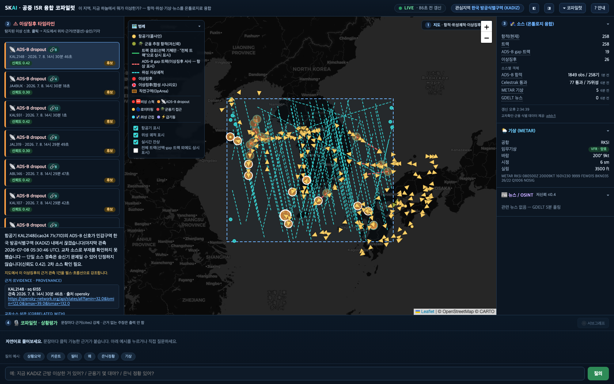

온보딩을 닫은 직후의 기본 화면 — **실데이터**. 좌측 이상징후 타임라인(캡처 시점 실측 26건, 전부
ADS-B dropout), 중앙 지도(KADIZ 작전구역·실항적 258대·위성 지상궤적), 우측 소스/기상/뉴스 패널,
하단 코파일럿 도크가 한 화면에 조립됩니다. 지도 위 이상징후 마커는 `Anomaly` 온톨로지 객체, 좌측
목록 항목은 같은 객체를 시간순으로 렌더한 것 — 클릭하면 지도 포커스·근거 흐름선·상세 카드가 동시에
갱신됩니다. 헤더의 **LIVE** 배지·갱신 경과초가 재생 모드와 구분되는 지점입니다.

## 02. 범례 · 레이어 토글

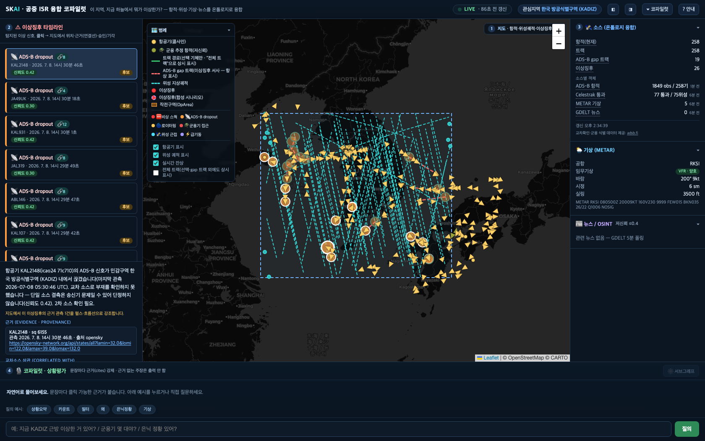

지도 좌상단 범례(기본 펼침 상태) — 항적(콜사인)·군용 추정 항적(저신뢰)·트랙 경로·ADS-B gap
트랙·위성 지상궤적·이상징후(실데이터/합성 구분 점선)·작전구역 기호, 그리고 이상징후 유형별 색상
칩. 하단 3종 토글(항공기 표시·위성 궤적 표시·실시간 잔상 — "전체 트랙"까지 포함하면 4종)은 지도
레이어의 on/off 스위치로, **민간 항공기 레이어**(항공기 표시 토글)와 위성 궤적 레이어를 독립적으로
끄고 켤 수 있습니다(온톨로지 객체 자체는 유지되고 지도 렌더만 토글). 이번 라이브 창엔 군용 추정
항적이 지도에 없었지만(아래 07 참조), 범례 항목 자체는 상시 표시됩니다.

## 03. 이상징후 상세 — 실 dropout(KAL2148)

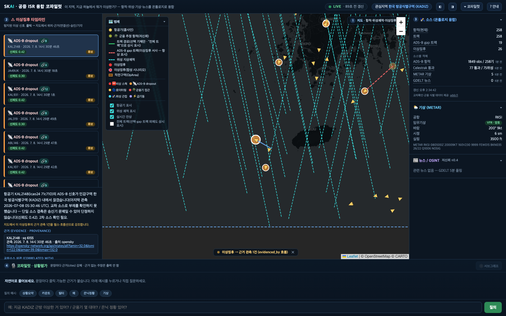

실측 이상징후 상세. 항공기 KAL2148(icao24 `71c710`)의 ADS-B 신호가 KADIZ 내에서 끊긴 건
(마지막 관측 2026-07-08 05:30:46 UTC, 출처 OpenSky, 신뢰도 0.42)으로, 설명문과 **근거
(EVIDENCE·PROVENANCE)** 카드가 좌측 상세 패널에 렌더됩니다. 카드는 `Anomaly` 객체의
`evidenced_by` 링크를 따라간 `Observation` 객체(콜사인·스쿽·관측 시각·출처 URL — 실제
opensky-network.org API 링크)를 그대로 보여주는 것 — 근거 없는 문장은 애초에 조립되지 않는다는
프로젝트 원칙(provenance 강제)의 시각적 증거입니다. 캡처 시점엔 아직 사람이 검토하지 않은
**"후보"** 상태(주황 배지)라 확인/기각 버튼이 활성 상태입니다. 신뢰도 0.42는 "단일 소스 결측 —
2차 소스 확인 필요"라는 솔직한 저신뢰 표기이며, 실제로 이 건은 이후 몇 분 뒤 기체가 재관측되며
자동으로 `resolved`(해소)로 전이되었습니다(11번 참조) — 규칙 기반 판정이 스스로 반증 가능하다는
증거이기도 합니다.

## 04. 교차소스 상관 — 실 dropout(KAL931)

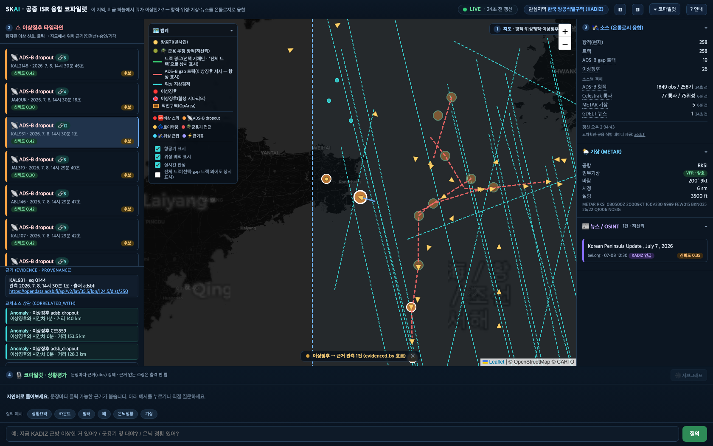

실측 ADS-B dropout 이상징후(항공기 KAL931, icao24 `71c746`, 출처 adsb.fi, 신뢰도 0.42)의
**교차소스 상관(CORRELATED_WITH)** 섹션. 같은 시간창에서 감지된 다른 dropout들과의 관계가 근거
문장으로 풀립니다 — 예: "이상징후와 시간차 0분 · 거리 153.5 km"(CES559), "시간차 1분 · 거리
128.3 km" 등. 이 문장은 `correlated_with` 링크의 `attrs`(시간차 `gap_s`, 거리 `distance_km`)를
그대로 자연어로 조립한 것으로, "왜 이 둘이 엮였는지"를 추측이 아니라 링크 속성으로 답합니다. 이
건은 실측 데이터에서 이상징후-이상징후 상관 외에 **뉴스(GDELT)·위성 통과(Celestrak)**까지 같은
`correlated_with` 메커니즘으로 엮여 있어(18건 상관 중 일부), 타입이 다른 온톨로지 객체끼리도 같은
근거 규약으로 연결된다는 걸 보여줍니다.

## 05. 군용기 접근 — PLAAF01 (replay 합성 재현 — 라이브에 해당 정황이 없을 때의 결정적 재현)

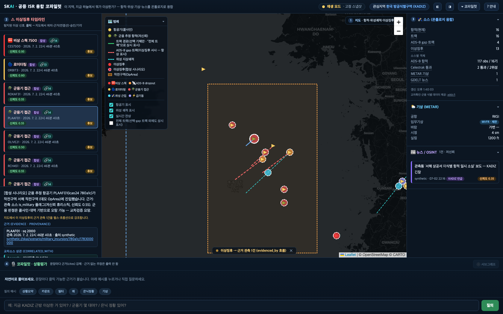

서해 작전구역 진입 이상징후. 이번 라이브 캡처 창(2026-07-08 05:32~05:37 UTC)엔 `military_approach`
유형 이상징후가 실측되지 않아 — 공개 ADS-B에 군용기 접근 시나리오가 상시 나타나지 않는다는 프로젝트
문서의 기존 고지 그대로 — **재생(replay) 모드**로 찍은 기존 캡처를 유지합니다. 설명문 앞의
**`[합성 시나리오]`** 태그는 실 ADS-B로 관측 불가능한 군용기 시나리오임을 명시하는 정직 표기이고,
"저신뢰 휴리스틱(신뢰도 0.55)"·"군용 판정은 콜사인·대역 기반으로 오탐 가능 — 교차검증 요망" 문구는
이 판정의 한계를 스스로 고지합니다. 실제 군용 식별은 관측 소스의 `is_military` 플래그(콜사인
프리픽스·대역 휴리스틱, live 모드에선 adsb.fi 2차 보강)에서 온 것이지 확정 판정이 아닙니다.

## 06. 코파일럿 — "지금 KADIZ 근방 이상한 거 있어?"

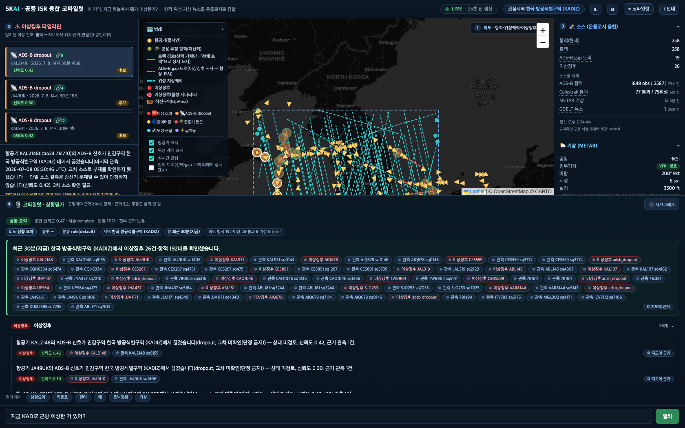

실데이터에 대한 코파일럿 응답 — "최근 30분(지금) 한국 방공식별구역(KADIZ)에서 이상징후 26건·
항적 192대를 확인했습니다." 상단 **투명성 스트립**(의도·슬롯·분류·지역·창·히트)이 이 질의가
어떻게 해석됐는지 먼저 밝히고, 본문 헤드라인과 이상징후별 문장마다 파란 **cites 배지**가 붙습니다.
각 배지는 `SituationAssessment` 객체가 인용한 `Anomaly`/`Observation` 객체로 직접 연결되는
링크 — "문장마다 근거 강제, 근거 없는 주장은 출력 안 함" 원칙이 화면에 드러나는 지점입니다. 실측
26건 전부(dropout)에 대해 문장이 조립돼 있어, 재생 모드의 13건 큐레이션 시나리오보다 실제 스케일이
큽니다.

## 07. 코파일럿 — "군용기만 보여줘" (필터 의도 — 실데이터의 정직한 '없음' 응답)

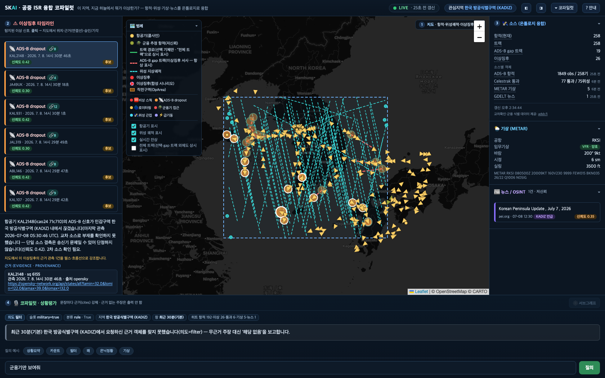

같은 코파일럿이지만 의도 분류가 **필터**(`military=true`)로 잡혀 조건에 맞는 항적을 찾습니다.
이번 라이브 창에서는 **"요청하신 근거 객체를 찾지 못했습니다(의도=filter) — 무근거 주장 대신
'해당 없음'을 보고합니다"**로 응답했습니다 — 실제로 캡처 시점 폴링 반경엔 adsb.fi 군용 식별
보강으로 `is_military=true`가 붙은 실항적 3대(콜사인 MAGIC52·CATS77·KARAS51)가 존재했지만,
전부 KADIZ Region의 지오펜스(bbox) **바깥**에서 관측돼 이 필터 조건(지역+군용) 교집합이 0건이었기
때문입니다. 즉 이 화면은 "군용기 필터가 안 됨"이 아니라 "근거 없는 결과를 지어내지 않는다"는
프로젝트 핵심 원칙이 실측 데이터로 증명된 사례입니다 — 재생 모드에서는 합성 군용기 5대
(ROKAF31·PLAAF01·OLIVE21·RCH451·FALCON9)가 항상 KADIZ 안에 있어 채워진 목록이 나왔던 것과
대비됩니다.

## 08. 온톨로지 서브그래프

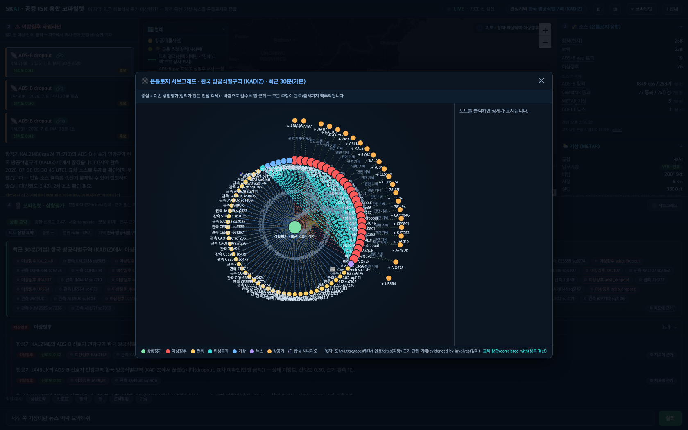

"서해 쪽 기상이랑 뉴스 맥락 요약해줘" 질의가 만든 `SituationAssessment` 객체(중앙 초록 노드)를
중심으로, 인용된 `Anomaly`(빨강, 실측 26건)·`Observation`(주황)·위성/기상/뉴스 노드가 방사형으로
펼쳐진 그래프 — **실데이터**로 재현했습니다. 청록 점선은 `correlated_with`(교차 상관) 엣지, 실선은
`cites`/`evidenced_by`/`involves` 등 인용·근거 엣지 — 하단 범례가 노드 색과 엣지 종류를 함께
설명합니다. 재생 모드의 13개 큐레이션 시나리오보다 실측 26건이 서로 촘촘히 교차상관돼 있어 그래프
밀도가 훨씬 높습니다(라벨이 일부 겹칠 정도) — 온톨로지 상관 엔진이 큐레이션된 소수 사례가 아니라
실세계의 지저분한 스케일에서도 동작한다는 증거로 택했습니다. 가독성보다 실측 증거를 우선한 선택이라,
개별 라벨 판독이 필요하면 라이브 앱에서 직접 노드를 클릭해 상세를 봐야 합니다.

## 09. 소스 패널 · 기상 · 뉴스 (우측 열 확대) — 라이브의 강점

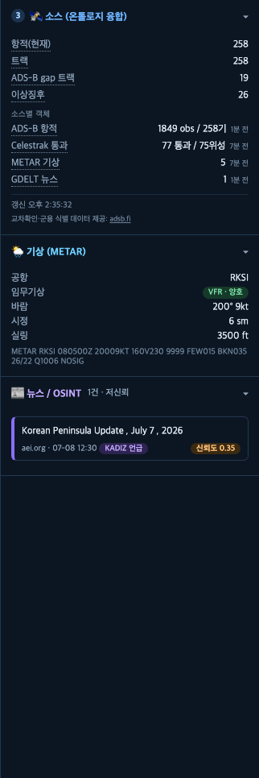

온톨로지로 융합된 4개 소스(ADS-B 항적·Celestrak 위성 통과·METAR 기상·GDELT 뉴스)의 객체 카운트와
**소스별 신선도**("1분 전"·"7분 전" 등 실측 경과시간) — 이게 재생 모드엔 없는, 라이브 모드만의
표식입니다. 그리고 **adsb.fi**(교차확인·군용 식별 보강 데이터 제공처) 크레딧 링크. 기상 카드는
RKSI 공항의 실측 METAR(VFR·양호, 풍향 200°/9kt, 시정 6sm, 실링 3500ft) 실황이고, 뉴스 카드는
캡처 도중 GDELT에서 실제로 새로 수신된 기사("Korean Peninsula Update, July 7, 2026", aei.org,
신뢰도 0.35 — 저신뢰 OSINT 표기)가 달린 `NewsEvent` 객체입니다. 뉴스는 항상 저신뢰로 표기되며
단독으로 판정 근거가 되지 않습니다. (참고: 이 뉴스 1건은 5분 GDELT 폴링 주기상 캡처 세션 도중에
막 도착한 것이라 — 이 스크린샷은 그 직후 재캡처해 반영했습니다.)

## 10. 이상징후 결정 루프 — confirm 후

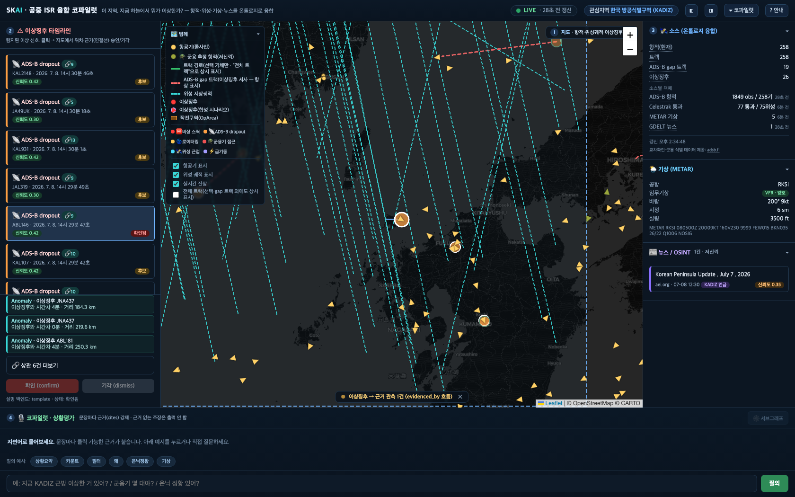

실측 dropout 이상징후(항공기 ABL146, icao24 `71ba11`)를 사람이 **확인(confirm)**한 직후 상태 —
실제로 서버 API(`POST /api/anomalies/{id}/confirm`)를 호출해 라이브 DB에 상태 전이를 영속시켰습니다.
타임라인 배지가 "후보"(주황)에서 **"확인됨"**(빨강)으로 바뀌고, 상세 패널 하단의 확인/기각 버튼이
비활성화되며 "상태: 확인됨" 문구가 남습니다. 이 상태 전이는 서버에 영속되는 `Anomaly` 객체의 액션 —
코파일럿이 답하고 끝나는 게 아니라 사람의 승인이 실제 상태를 바꾸는 **결정 루프
(human-on-the-loop)**의 증거입니다. 헤더는 여전히 LIVE 상태를 유지합니다.

## 11. 해소됨(resolved) 접힌 그룹 — dropout 자동 해소 (bonus)

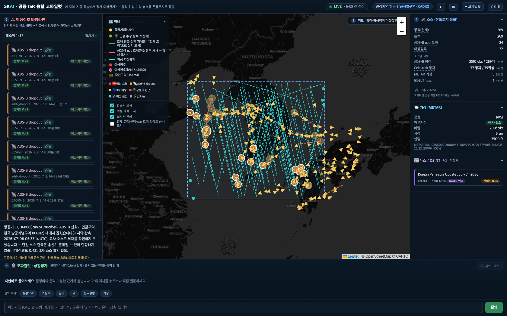

좌측 타임라인 하단의 **"해소됨 14건"** 접이식 그룹을 펼친 상태. 각 항목엔 **"해소(복귀 확인)"**
배지가 붙어 있고, 상세 패널엔 "해소 사유" 섹션이 이 dropout 주장이 어떻게 반증됐는지(기체가
다시 관측돼 복귀 확인) 설명합니다. `dismissed`(사람이 오판으로 기각)와 달리 `resolved`는
**시스템이 스스로 주장을 접은** 상태 — 규칙 기반 이상탐지가 실시간으로 계속 재평가되며, 초기
저신뢰(0.42, "단일 소스 결측") 판정이 시간이 지나 근거가 사라지면 자동으로 닫힌다는 걸 보여주는
라이브 전용 증거입니다(재생 모드의 고정 스냅샷에선 시간이 흐르지 않아 이런 자동 해소가 나타나지
않습니다). 이 스크린샷은 라이브 데이터에서만 자연 발생하는 상태라 재생 모드엔 대응 화면이 없습니다.

---

## 관련 문서

- [USER-GUIDE.md](USER-GUIDE.md) — 화면 구역별 상세 설명, 실행 모드 4가지, 핵심 동선
- [README.md](../README.md) — 프로젝트 개요, 온톨로지 스펙, 심사 기준 대응
- [ontology.md](../ontology.md) — 객체·링크·액션 타입 전체 스펙
