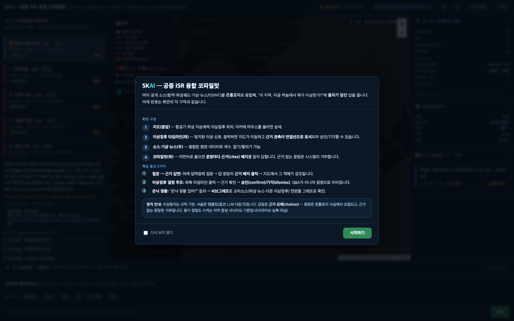
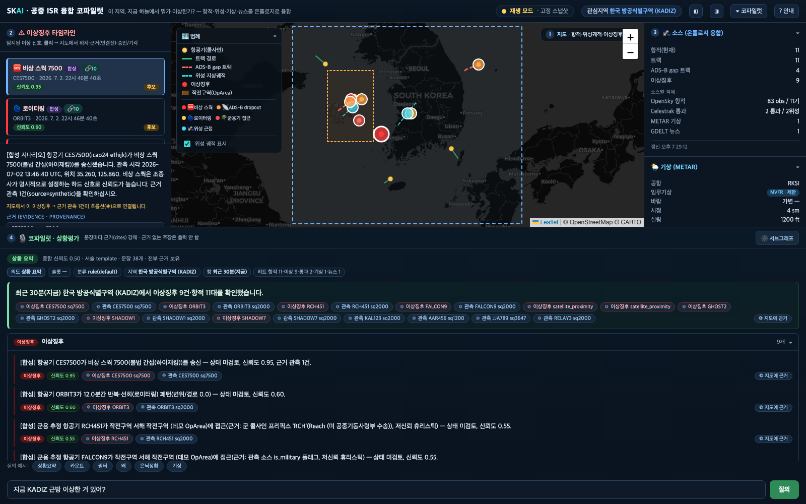
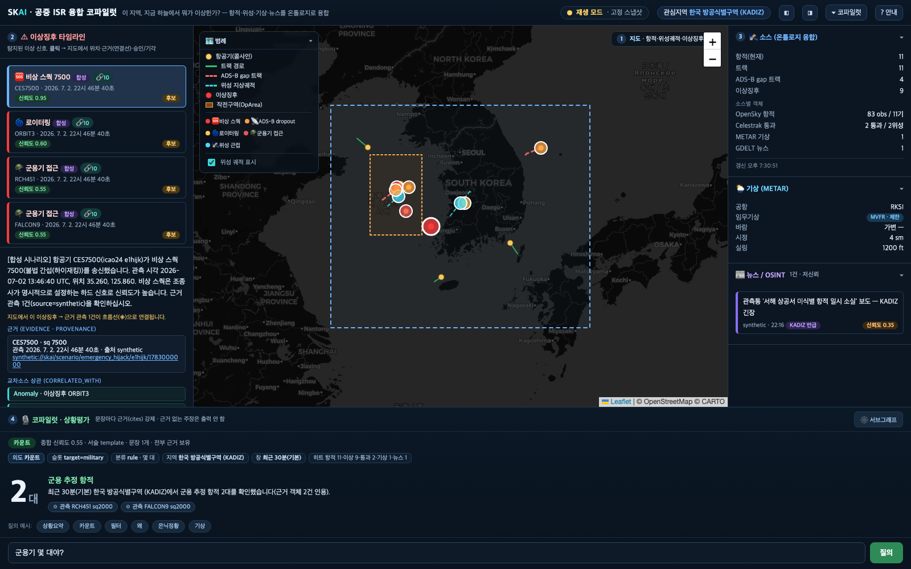
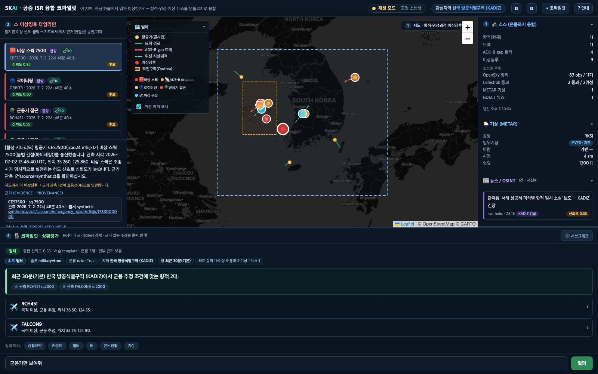
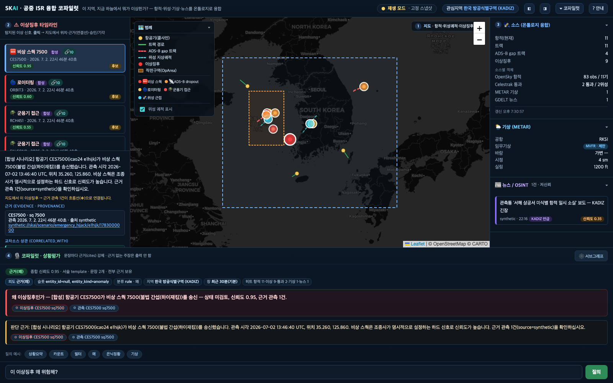
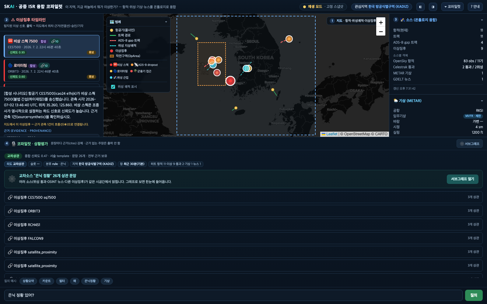
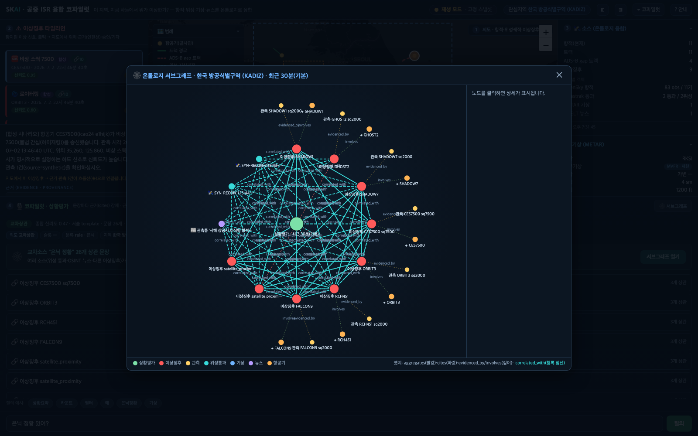
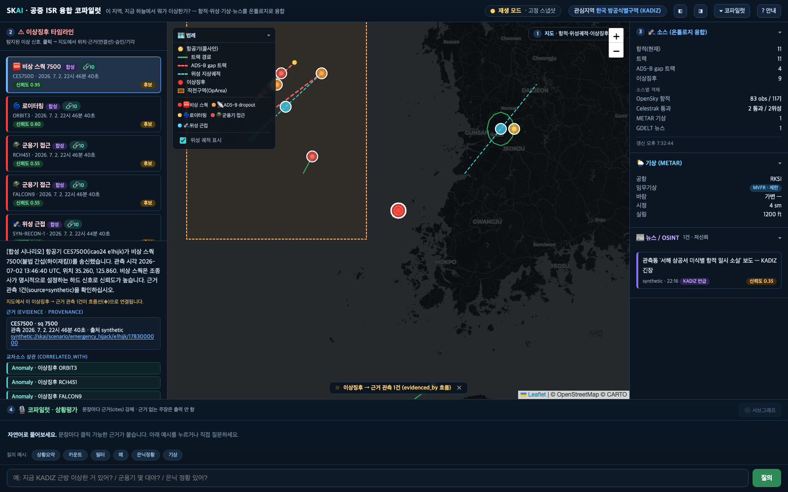
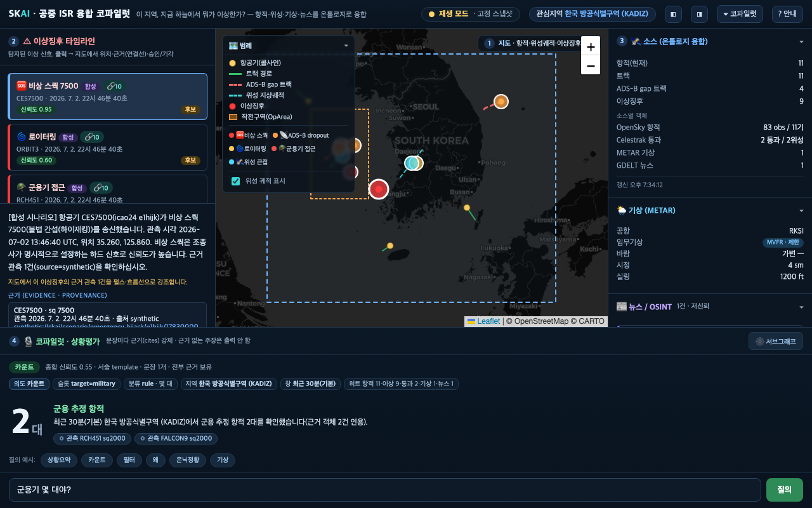

# SKAI 사용 설명서 — 공중 ISR 융합 코파일럿

> **한 줄**: "이 지역, 지금 하늘에서 뭐가 이상한가?" — 공개 소스(항공기 항적·위성 궤도·기상·뉴스/OSINT)를
> 온톨로지로 융합해, **출처가 달린** 상황 요약과 이상징후를 지도·타임라인·코파일럿으로 답하는 화면입니다.

이 문서는 **재설계된 프론트(`web/index.html`)** 화면을 기준으로, 각 구역이 무엇을 보여주고 어떻게
조작하는지, 그리고 핵심 사용 동선 3가지를 설명합니다. 화면의 각 패널에는 ①②③④ 번호가 붙어 있고,
이 문서의 번호와 같습니다.

---

## 0. 실행법

```bash
# 발표 기본 — 네트워크 0, 결정적 재생(스냅샷). 오프라인에서도 즉시 동작.
scripts/demo.sh replay
#   → http://localhost:8000  접속

# 라이브(순수) — 다중소스 실 API 연속 폴링, 실데이터만(합성 없음).
scripts/demo.sh live

# 라이브(임팩트) — 순수 라이브 + 내러티브 합성 1건(데모 서사).
scripts/demo.sh live --inject

# 중지 / 상태
scripts/demo.sh stop
scripts/demo.sh status
```

### 모드 4가지 (각 성격·기동·env)

| 모드 | 기동 | 데이터 | 결정성 | 주요 env |
|---|---|---|---|---|
| **replay**(발표 기본) | `scripts/demo.sh replay` | 데모 전용 DB(`data/demo/skai_demo.db`)에 합성 시나리오 전량. **네트워크 0**(오프라인 강제). | **결정적**(같은 입력=같은 화면, 바이트 단위) | `SKAI_OFFLINE=1`·`SKAI_NOW_ANCHOR`(내부 자동) |
| **live**(순수) | `scripts/demo.sh live` | **실데이터만** — OpenSky 항적·GDELT 뉴스·METAR 기상·Celestrak 위성을 각자 주기로 연속 폴링. 합성 주입 없음. | 비결정(실시간 변동) | `SKAI_POLL_SOURCES`(기본 `opensky,gdelt,metar,celestrak`), `SKAI_POLL_INTERVAL`(기본 25s) |
| **live --inject** | `scripts/demo.sh live --inject` | 순수 라이브 + 내러티브 합성 1건(라이브 KADIZ엔 재현성 있는 이상징후가 상시 없으므로 데모 서사용). | 비결정 + 고정 서사 1건 | 위와 동일(내부에서 `--allow-live-db`로 합성 1건 승인) |
| **Foundry(read+AIP)** | 서버를 `SKAI_STORE=foundry SKAI_COPILOT_LLM=aip SKAI_DB=data/demo/skai_foundry_local.db`로 기동(+`scripts/demo_foundry.sh`가 먼저 Foundry에 write) | 화면 정보소재 read가 **실 Palantir Foundry**, 상황요약 헤드라인은 **AIP Logic 생성**. | 비결정(AIP는 LLM 서술) | `SKAI_STORE=foundry`·`SKAI_COPILOT_LLM=aip`·`.venv312`(OSDK)·`.env`(FOUNDRY_TOKEN 등) |

- **replay 모드**: 데이터가 고정된 스냅샷입니다. 헤더의 상태 배지가 노란색 **"재생 모드 · 고정 스냅샷"**으로
  표시됩니다. 발표·리허설·스크린샷 재현용(같은 입력 = 같은 화면). `store_backend=local`.
- **live 모드**: 4소스가 각자 주기로 갱신됩니다(항적 25s·뉴스 5m·기상 30m·위성 12h). 헤더 배지가 녹색으로
  점멸하며 **"LIVE · N초 전 갱신"**을 보여주고, 지도 마커가 실제로 움직입니다. 뉴스 카드는 **실 기사 URL로
  클릭 가능**(GDELT). 군사 항공 RSS 4피드(theaviationist·twz·defensenews·yonhap)는 **옵션**이라 기본엔 없고
  `SKAI_POLL_SOURCES=opensky,gdelt,metar,celestrak,rss`로 켭니다.
- **Foundry 모드**: `SKAI_STORE=foundry`면 화면·코파일럿의 정보소재 read가 실 Palantir Foundry에서 옵니다
  (`store_backend=foundry`). `SKAI_COPILOT_LLM=aip`를 더하면 상황요약 헤드라인을 **AIP Logic이 생성**합니다
  (`produced_by=aip_logic`). 단 **탐지·근거 강제·문장별 cites는 로컬 엔진 그대로** — AIP는 서술만 담당하고,
  기본값은 재현성을 위해 template입니다(aip는 opt-in). 상세는 §6·§8과 `docs/worklog/foundry-read-mode.md`·
  `aip-logic-wire.md`·`region-summary-wire.md`.

첫 진입 시 **온보딩 안내**가 자동으로 뜹니다(화면 구성 + 핵심 동선 요약). 헤더 오른쪽 **`? 안내`** 버튼으로
언제든 다시 볼 수 있습니다. `?q=...` 같은 공유·재현 딥링크로 들어오면 온보딩은 건너뜁니다.



---

## 1. 화면 구역 (전체 레이아웃)

화면은 **헤더바 · 좌(이상징후) · 중앙(지도) · 우(소스) · 하단(코파일럿)**의 5부 그리드입니다.
좌/우 패널과 코파일럿은 헤더의 토글 버튼으로 접어 지도를 넓힐 수 있습니다.



### 헤더바 (최상단)
- **브랜드 + 한 줄 설명**: 이 앱이 무엇인지.
- **데이터 상태 배지**: `재생 모드`(노랑, 고정 스냅샷) 또는 `LIVE · N초 전 갱신`(녹색 점멸, 라이브).
  `/api/live`의 마지막 폴링 시각으로 판정합니다. 지연 시 주황색 `지연`으로 바뀝니다.
- **관심지역 칩**: 현재 지역(KADIZ).
- **토글 버튼**: `◧`(좌 패널) · `◨`(우 패널) · `▾ 코파일럿`(하단 접기) · `? 안내`(온보딩 재열기).

### ① 지도 (중앙) — 무엇이 어디 있나
- 항공기(노란 점, 콜사인 툴팁) · 트랙 경로(초록) · **ADS-B gap 트랙**(빨강 점선, 신호 끊김 의심) ·
  위성 지상궤적(청록 점선) · 이상징후(빨강/유형색 원) · 관심지역(KADIZ 파랑) · 작전구역(OpArea 주황).
- 왼쪽 위 **범례**(접이식)에서 색·유형의 뜻과 위성 궤적 표시 토글을 제공합니다.
- 마커에 마우스를 올리면 상세(콜사인·스쿽·신뢰도 등)가 뜹니다.

### ② 이상징후 타임라인 (좌) — 지금 이상한 신호
- 탐지된 이상징후를 유형 아이콘(🆘 비상 스쿽 · 📡 ADS-B dropout · 🌀 로이터링 · 🪖 군용기 접근 ·
  🛰 위성 근접)·신뢰도·상태(후보/확인됨/기각됨) 배지로 나열합니다. `🔗N`은 교차소스 상관 건수.
- 항목을 **클릭**하면 지도가 그 위치로 이동하고, **근거 관측이 펄스·흐름선으로 강조**되며(→ §5),
  아래에 상세(설명·근거 출처·교차상관)와 **승인/기각 버튼**이 열립니다.

### ③ 소스 · 기상 · 뉴스 (우) — 융합된 원천 데이터
- **소스**: 현재 항적·트랙·gap·이상징후 개수 + 소스별 객체(OpenSky/Celestrak/METAR/GDELT).
- **기상(METAR)**: 대표 공항(RKSI)의 임무기상 범주(VFR/MVFR/IFR/LIFR)·바람·시정·실링.
- **뉴스/OSINT**: GDELT 등 **저신뢰(≤0.4)** 언급. 확증이 아니라 교차검증용 맥락입니다.
- 각 섹션 헤더를 클릭하면 접기/펼치기.

### ④ 코파일럿 (하단) — 자연어로 물어보기
- 입력창에 질문하면 **문장마다 근거(cites) 배지**를 달아 답합니다. **근거 없는 문장은 시스템이 거부**합니다.
- 답변 위에 **투명성 스트립**(의도·슬롯·분류 근거·지역·시간창·소스 히트)이 작게 표시됩니다.
- 질의 예시 버튼(상황요약/카운트/필터/왜/은닉정황/기상)으로 바로 시험할 수 있습니다.

---

## 2. 의도별 답변 렌더 (코파일럿)

같은 코파일럿이 **질문 의도를 분류**해 답변 표현을 다르게 보여줍니다. 상단 투명성 스트립에서 분류된
의도·슬롯을 항상 확인할 수 있습니다(모든 문장은 근거를 가집니다).

| 의도 | 트리거 예 | 화면 표현 | 스크린샷 |
|---|---|---|---|
| **상황 요약** `situation_summary` | "지금 KADIZ 상황", "요약해줘" | 헤드라인 카드 + **kind별 접이식 그룹**(이상징후·상관·기상·뉴스). 많은 문장을 접어서 정돈 | ui_redesign_02 |
| **카운트** `count` | "군용기 몇 대야?" | **큰 숫자 히어로** + 대상 라벨 + 근거 배지 | ui_redesign_03 |
| **필터** `filter` | "군용기만 보여줘" | 헤드라인 + **항적 카드 리스트**(클릭 시 지도 이동) | ui_redesign_04 |
| **근거/왜** `why`·`entity_explain` | "이 이상징후 왜 위험해?" | **근거 카드 중심**(설명 강조 + "판단 근거" 카드) | ui_redesign_05 |
| **교차상관** `correlation` | "은닉 정황 있어?" | **서브그래프 유도 카드** + 앵커 이상징후별 상관 클러스터 | ui_redesign_06 |
| **기상/뉴스** `weather`·`news` | "기상 어때?" / "관련 뉴스" | 단일 카드 | — |

### 카운트 — 큰 숫자로 한눈에


### 필터 — 조건에 맞는 항적 리스트


### 왜(근거) — 판단 근거 카드


### 은닉 정황(교차상관) — 서브그래프로 유도


---

## 3. 핵심 동선 3가지

### 동선 ① 질문 → 근거 답변 (환각 없는 대화)
1. 하단 코파일럿 입력창에 질문(예: "지금 KADIZ 근방 이상한 거 있어?").
2. 답변의 각 문장에 붙은 **근거 배지(◎)를 클릭**.
3. 지도가 그 객체 위치로 이동하고 **녹색 펄스**로 강조됩니다. 좌표 없는 근거(뉴스/기상)는 배지에서
   **원 소스 링크**로 이동. 문장 오른쪽의 **`◎ 지도에 근거`**를 누르면 그 문장의 근거 여러 건을
   지도에 한꺼번에(fitBounds) 표시합니다 — 하나의 주장을 뒷받침하는 근거가 공간적으로 어떻게 퍼져
   있는지 보입니다.

### 동선 ② 이상징후 결정 루프 (Q&A가 아니라 결정)
1. 좌측 **이상징후 타임라인**에서 항목 클릭.
2. 지도 이동 + 근거 강조 + 상세(설명·근거 출처·교차상관) 확인.
3. **승인(confirm)** 또는 **기각(dismiss)**. 상태가 온톨로지에 전이되고 화면이 즉시 갱신됩니다.
   → 분석가의 OODA(관측-판단-결정-행동)를 단축하는 human-on-the-loop 워크플로.

### 동선 ③ 은닉 정황 (교차소스 서브그래프)
1. "은닉 정황 있어?" 질의 → 교차상관 답변.
2. **`서브그래프 열기`** 클릭.
3. Assessment를 중심으로 이상징후·관측·위성 통과·뉴스가 `correlated_with`·`evidenced_by`로 얽힌
   그래프를 확인. 노드를 클릭하면 상세와 원 소스, "지도에서 보기"를 제공합니다.



---

## 4. 실시간(LIVE) / 재생 모드

- 헤더 상태 배지는 `/api/live`를 주기적으로 폴링해 판정합니다.
  - **재생 모드**(노랑): 폴러 없음(`last_poll_ts` 없음). `demo.sh replay`에서 고정 스냅샷.
  - **LIVE**(녹색 점멸): 폴러 있음 + 마지막 폴링이 신선함. **"N초 전 갱신"** 표시. `demo.sh live`.
  - **지연**(주황): 폴러가 있으나 신선도 기준을 벗어남.
- 지도·패널은 폴링 주기에 맞춰 **자동 갱신**됩니다(라이브 기본 25초, 재생 30초). 라이브에서는 항적
  마커가 실제로 이동합니다.
- 질의 처리 중에는 코파일럿 답변 영역에 **로딩 스피너**가 표시됩니다.

### read 소스 배지 · 소스별 신선도 (API 제공 — 일부 프론트 표시 예정)

`/api/live`·`/api/stats`가 아래 필드를 제공합니다. **필드는 백엔드에 이미 있고, 프론트 렌더는 항목별로
"현재 표시" / "표시 예정"을 정직하게 구분**합니다.

| 필드 | 뜻 | 프론트 표시 |
|---|---|---|
| `store_backend` | 화면 정보소재 read 출처: `local`(로컬 SQLite) 또는 `foundry`(실 Palantir Foundry). | **표시 예정** — LIVE 배지 옆 "Palantir Foundry read / 로컬 SQLite read". 지금은 API로만 확인 |
| `sources` | 활성 폴링 소스 리스트(예: `["opensky","gdelt","metar","celestrak"]`). | **표시 예정** |
| `source_last_poll` | `{소스: 마지막 폴 시각}` — 소스별 최신성(미폴은 0). | **표시 예정** — "뉴스 3m 전·기상 12m 전"처럼 소스별 신선도. 없으면(구 사이드카/replay) 전체 `last_poll_ts`로 폴백 |
| `source_last_status` | `{소스: "ok"/"error"/"pending"}` — 소스별 마지막 폴 결과. | **표시 예정** — `error`면 경고 |
| `last_poll_ts`·`live`·`mode` | 전체 신선도·LIVE 여부(**현재 헤더 배지가 사용**). | **표시 중** |

- `source_last_status="ok"`는 **폴 호출이 예외 없이 완료됨**을 뜻합니다(행 저장 성공이 아님). 예: GDELT가
  429로 스킵하거나 기사 0건이어도 `ok`이고, 실패 상세는 폴러 로그에 남습니다.
- replay·기본 데모는 항상 `store_backend=local`(결정성). `store_backend`는 read 소스일 뿐 **"AIP가 추론한다"는
  뜻이 아닙니다** — 추론(탐지·평가)은 로컬 엔진, AIP Logic은 설명·요약 서술만(§0 Foundry 모드).

---

## 5. "근거가 흐르는" 시각화

- **이상징후 클릭** → 그 이상징후를 뒷받침하는 **근거 관측이 지도에서 펄스**로 뛰고,
  이상징후와 좌표가 다른 근거는 **흐름선(evidenced_by, 점선이 흐르는 애니메이션)**으로 연결됩니다.
  지도 하단에 `이상징후 → 근거 관측 N건 (evidenced_by 흐름)` 안내가 뜹니다.
- **답변 문장의 근거 배지/`◎ 지도에 근거`** → 인용 객체를 지도에 펄스로 강조(+여러 건이면 한 화면에
  모아 표시). 근거→객체→원 소스로 이어지는 추적 동선입니다.
- 지우기: 지도 하단 안내의 `✕`.



> 참고: 현재 데모 데이터에서는 대부분 이상징후가 자신의 근거 관측과 **같은 좌표**에 있어(이상징후가
> 그 관측에서 파생) 흐름선이 짧고 펄스가 주가 됩니다. 근거가 공간적으로 퍼지는 "흐름"은 코파일럿
> **상관 문장의 `◎ 지도에 근거`**(이상징후 + 위성 통과 여러 지점)에서 가장 뚜렷합니다.

---

## 6. 질의 예시표 (이럴 때 이렇게 물어보세요)

| 알고 싶은 것 | 이렇게 물어보세요 | 분류되는 의도 |
|---|---|---|
| 지금 전반 상황 | "지금 KADIZ 근방 이상한 거 있어?" · "상황 요약해줘" | situation_summary |
| 개수 | "군용기 몇 대야?" · "이상징후 몇 건?" · "항적 몇 대?" | count |
| 조건 필터 | "군용기만 보여줘" · "미국 국적만" · "○○ 소속" · "기종 ○○" | filter |
| 특정 대상 설명 | (지도/타임라인에서 선택 후) "이거 뭐야?" · "이 위성 뭐야?" | entity_explain |
| 위험 근거 | "이 이상징후 왜 위험해?" · "근거는?" | why |
| 숨은 연관 | "은닉 정황 있어?" · "숨은 연관 보여줘" | correlation |
| 기상 | "서해 쪽 기상 어때?" | weather |
| OSINT | "관련 뉴스 있어?" | news |

- **국적 필터**는 질의에 "국적" 단어가 있어야 발동합니다(지역 별칭 "한국"과의 혼동 방지).
  국가명은 영문(예: "United States", "South Korea").
- **군용 판정은 저신뢰**입니다(콜사인·ICAO 대역 휴리스틱). 문장에 "군용 추정"으로 표기되고 신뢰도가
  낮게(≈0.5) 나옵니다 — 단정하지 않습니다.
- 근거를 못 찾으면 **"해당 없음"**을 정직하게 보고합니다(엉뚱한 객체로 대체하지 않음).

### 답변 서술 백엔드 — template vs AIP Logic (`produced_by`)

같은 질의라도 서술을 **누가 쓰느냐**가 모드로 갈립니다. 응답의 `produced_by` 필드로 확인합니다.

| 모드 | `produced_by` | 상황요약 헤드라인 서술 | cites·탐지·평가 |
|---|---|---|---|
| **기본**(replay·live) | `template` | 룰 기반 템플릿(결정적) | 룰 엔진 |
| **AIP**(Foundry + `SKAI_COPILOT_LLM=aip`) | `aip_logic` | **Foundry AIP Logic이 생성**(`region-situation-summary` 함수가 Anomaly 객체를 읽어 종합) + `overallAssessment` 한줄판정 | **동일**(룰 엔진 — AIP는 서술만) |

- **핵심(정직)**: AIP 모드에서도 **문장별 `cites`는 template 모드와 완전히 같습니다.** provenance(근거
  역추적)는 룰이 보장하고, AIP는 상황요약 **헤드라인 서술**만 바꿉니다. 개별 이상징후 설명도 AIP로
  생성할 수 있습니다(`SKAI_EXPLAINER=aip`, `explain-anomaly` 함수 — 현재 비상 스쿽 경로).
- AIP 모드는 **Foundry 스토어일 때만·situation_summary 의도일 때만** 켜지고, 크리덴셜·OSDK 부재나 호출
  실패 시 자동으로 `template(aip 폴백)`으로 강등됩니다(답변은 항상 나옴). 기본값이 template인 이유는
  재현성(같은 스냅샷=같은 답) — AIP LLM 서술은 매번 미세하게 달라 replay 결정성과 상충하기 때문입니다.

---

## 7. 빈 상태 / 오류 상태

- **이상징후 없음**: 타임라인에 합성 시나리오 주입 명령을 안내.
- **기상/뉴스 없음**: "데이터 없음 / 관련 뉴스 없음" 문구.
- **질의 근거 없음**: 코파일럿이 회색 카드로 "해당 없음"을 표시.
- **갱신 실패**: 우측 소스 패널 하단 스탬프에 "갱신 실패: <사유>".

---

## 8. 백엔드에 추가로 필요한 필드

**현재 렌더에는 없음.** 이번 재설계는 `docs/worklog/copilot-backend-api.md`에 명세된 계약만으로 전부 렌더합니다.

- 의도별 렌더: `/api/assess`의 `intent`·`slots`·`intent_meta`·`sentences[].kind/cites/confidence`·
  `cited_objects[id].{type,label,lat,lon,source_url,status}` 사용.
- LIVE/재생: `/api/live`의 `live`·`last_poll_ts`·`mode`·`interval`·`server_now` 사용.
- 근거 흐름(연결선): 기존 `/api/anomalies`의 `evidence[].{lat,lon,...}`·`lat/lon` 사용(무변경 엔드포인트).

> 향후 강화 아이디어(현재 계약으로 대체 가능, 필수 아님): 이상징후의 비-관측 근거(위성 통과 등)에
> 좌표가 있으면 `evidenced_by` 흐름선을 관측 외 근거까지 확장 가능. 지금은 좌표 있는 근거만 연결선,
> 나머지는 상세 카드로 표기합니다.

### 2026-07-04 추가된 옵션 필드 (백엔드 제공 · 프론트 표시 예정)

아래는 백엔드가 새로 노출하지만 **현재 프론트가 아직 렌더하지 않는** 필드입니다(§4·§6에 상세). 렌더는
후속 web/ 작업 — 지금은 API로 확인 가능하고, 값이 없으면(구 사이드카/replay) 기존 필드로 폴백합니다.

- `/api/stats`·`/api/live` → **`store_backend`**(`local`|`foundry`) : read 소스 배지(§4).
- `/api/live` → **`sources`·`source_last_poll`·`source_last_status`** : 소스별 신선도 배지(§4).
  없으면 전체 `last_poll_ts`로 폴백.
- `/api/assess` → **`produced_by`**(`template`|`aip_logic`)·**`overall_assessment`** : AIP Logic 서술
  모드 표기(§6). `cites`·`cited_objects` 계약은 두 모드에서 **동일**(provenance 불변).

---

## 부록: 반응형

발표 화면(1600×1000) 기준으로 설계했으며, 좁은 창(예: 1280×800)에서도 레일 폭이 줄며 레이아웃이
유지됩니다. 필요 시 헤더 토글로 좌/우 패널·코파일럿을 접어 지도를 넓힐 수 있습니다.


